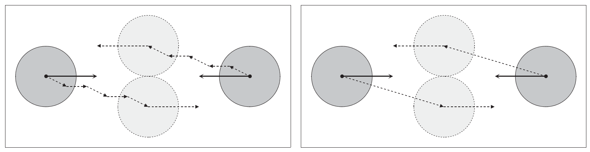
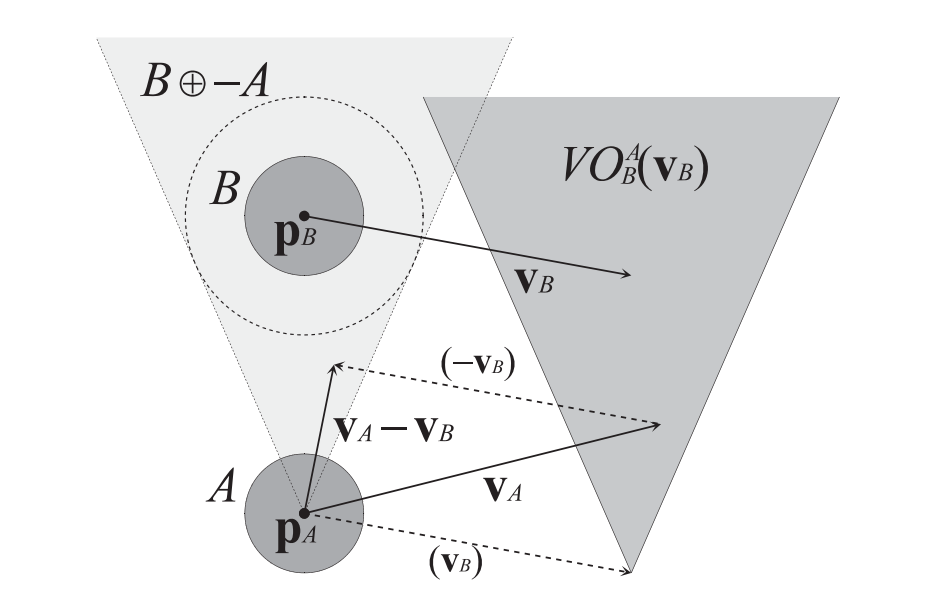
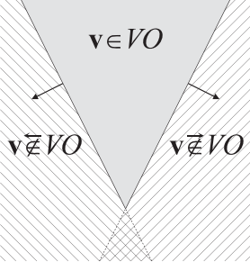
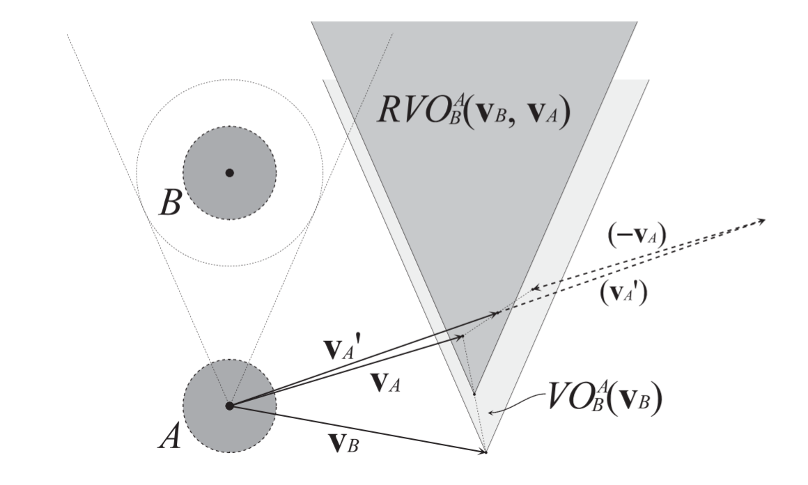

# 碰撞规避算法RVO(Reciprocal Velocity Obstacles)简介

## 0x01  概述

&emsp;&emsp;碰撞规避算法，广泛的应用于机器人、人群模拟、3A游戏、交通工程等领域。这里所说的Agent，可以表示一个单独的行人，一个行走的机器人或是一辆开动的车。

&emsp;&emsp;注意，这里说的碰撞规避（collision-avoidance），不是碰撞的物理计算。碰撞规避是避免Agent之间发生碰撞，而碰撞物理计算则是模拟计算物体发生碰撞之后的形变，反弹，破碎等。

## 0x02  VO(Velocity Obstacle)简介

RVO算法是在VO算法基础之上，成功优化解决了路径抖动问题。所以先简单介绍下VO的相关概念。

图0，左边是基础VO算法，两个相向而行的物体，在规避碰撞时产生了路径抖动。而右图，RVO解决了这一问题。具体证明请看下文。  

- ### 定义

  &emsp;&emsp;设A为在平面移动的物体（Agent），其在平面的位置记为$p_A$，B为平面中移动的障碍，其位置记为$p_B$。速度障碍记为$VO_B^A(v_B)$，它表示障碍物B如果以速度$v_B$行进，将来某一时刻，会造成A，B相撞的A物体速度$v_A$的集合。其几何意义如下图所示：

  

  
图1

&emsp;&emsp;$A\oplus B$表示A，B的闵科夫斯基和（[Minkowski sum](https://en.wikipedia.org/wiki/Minkowski_addition)）。闵氏和是一个几何操作，在这里的作用是将障碍物增大，这样就可以把$p_A$视为一个质点了，方便后续处理。-A表示物体A点集取反，定义如下：
$$
A\oplus B=\lbrace a+b|a \in  A,b \in  B\rbrace，-A=\lbrace -a|a \in A\rbrace.
$$
&emsp;&emsp;设$\lambda(p,v)$为起始于位置p，指向速度v方向的射线：
$$
\lambda (p,v)=\lbrace p+tv|t\geq 0\rbrace.
$$
&emsp;&emsp;如果起始于$p_A$，方向为A相对于B的相对速度（$v_A-v_B$）的射线，指向以$p_B$为中心的$B\oplus -A$

闵氏和锥形区域，表示速度$v_A$在B的速度障碍中。因此，B对A的速度障碍定义如下：

**定义1** (Velocity Obstacle)：
$$
VO_B^A(v_B)=\lbrace v_A|\lambda(p_A,v_A-v_B)\cap B\oplus-A\neq\emptyset \rbrace.
$$
&emsp;&emsp;它的意义是，如果$v_A\in VO_B^A(v_B)$表示拥有速度v_A的物体A与拥有速度v_B的物体B，将在未来一定时间内发生碰撞。如果$v_A\notin VO_B^A(v_B)$，则表示A与B不会发生碰撞。几何意义参看图1。

- ### 性质

**定理 2**（对称性）：
$$
v_A\in VO_B^A(v_B)\Leftrightarrow v_B\in VO_A^B(v_A).
$$
&emsp;&emsp;显而易见，如果v_A在B的速度阻挡中，表示A会撞上B，当然也表示B会撞上A。

**定理 3**（平移不变性）：
$$
v_A\in VO_B^A(v_B)\Leftrightarrow v_B+u\in VO_B^A(v_B+u).
$$
&emsp;&emsp;考虑速度障碍之外的区域。把这部分区域分为坐半区和右半区，可以看到，左半区和右半区是有重叠部分的，如下图所示。

图2

&emsp;&emsp;引入两个符号，$\overleftarrow{\notin }$和$\overrightarrow{\notin }$。如果速度v_A在VO_B^A(v_B)之外的左半区，表示v_A会使物体A从物体B的左边通过，记为：
$$
v_A\overleftarrow{\notin }VO_B^A(v_B)
$$
同样，如果速度$v_A$在$VO_B^A(v_B)$之外的右半区，表示$v_A$会使物体A从物体B的右边通过，记为：
$$
v_A\overrightarrow{\notin }VO_B^A(v_B)
$$
定理2，3同样适用于速度障碍之外的区域。也就是说定理2，3中的$\in$可以等价的转换为$\notin$，$\overleftarrow{\notin }$和$\overrightarrow{\notin }$。

**定理 4**（凸性）：
$$
v_A\overrightarrow{\notin}VO_B^A(v_B)\wedge v_A^,\overrightarrow{\notin}VO_B^A(v_B)\Rightarrow(1-\alpha)v_a+\alpha v_A^,\overrightarrow{\notin}VO_B^A(v_B),0\leq\alpha\leq1.这是根据[凸集](https://en.wikipedia.org/wiki/Convex_set)性质得到的。连接凸集中任意两点的一条线段，该线段上的每一个点都属于该凸集。x,y两点属于凸集S，那么点$(1-\alpha)x + \alpha y，0\leq\alpha \leq1.$必然也属于S。
$$
&emsp;&emsp;这是根据[凸集](https://en.wikipedia.org/wiki/Convex_set)性质得到的。连接凸集中任意两点的一条线段，该线段上的每一个点都属于该凸集。x,y两点属于凸集S，那么点$(1-\alpha)x + \alpha y，0\leq\alpha \leq1.$必然也属于S。

&emsp;&emsp;考虑这种情况，两个物体A和B，分别以速度v_A和速度v_B向各自的目标点行进，如果有$v_A\in VO_B^A(v_B)$，那么同时$v_B\in VO_A^B(v_A)$，于是他们在将来某一时刻会发生碰撞。此时，为了避免碰撞，A决定改变速度为$v_A^,$避免撞上B，于是有$v_A^,\notin VO_B^A(v_B)$。与此同时，B也决定改变速度为$v_B^,$，避免撞上A，于是有$v_B^,\notin VO_A^B(v_A)$。那么根据**定理2**，老的速度也必定不在新速度的VO里，于是有$v_A\notin VO_B^A(v_B^,)$同时$v_B\notin VO_A^B(v_A^,)$。由于A和B有一个最终的目标，在避障之后，需要往目标点走，而老速度$v_A$和$v_B$并不在当前速度$v_A^,$和$v_B^,$的VO里，于是老的速度会被重新选择。然而在下一个Tick，$v_A$和$v_B$被检测出会发生碰撞，于是又会触发速度改变，速度改变完成后，又会回到老的向目标点的速度。如此往复循环，直到彻底不会发生碰撞。这就是VO算法会发生抖动的原因。参看图0。

## 0x03 RVO（Reciprocal Velocity Obstacles）简介

&emsp;&emsp;RVO解决抖动的方法非常简单：不同于VO算法为每个物体选择一个在其他物体速度障碍之外的新速度，RVO选择当前速度与速度障碍之外速度的平均速度作为新的速度。

**定义 5**(Reciprocal Velocity Obstacle)
$$
RVO_B^A(v_B,v_A)=\lbrace v_A^,|2v_A^,-v_A\in VO_B^A(v_B)\rbrace.
$$
&emsp;&emsp;物体B对A的相互速度障碍$RVO_B^A(v_B,v_A)$包含所有当前速度$v_A$与$VO_B^A(v_B)$里速度的平均速度。其几何意义如图3所示，相当于一个顶点在$\frac{v_A+v_B}{2}$处的$VO_B^A(v_B)$。

=======